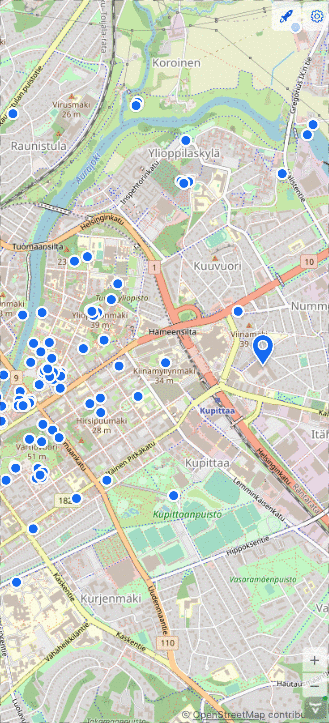
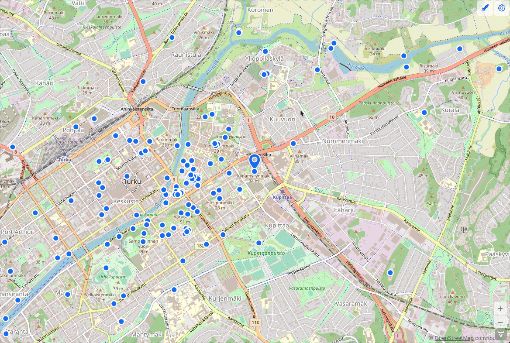

# hackathon-23-2 (manolo)

- POIs are displayed in the Map
  - Current position moves when user walks
  

- Click on POIs open an InfoBox with links to actions
  

- Right-aligned MenuBar with actions 
  - Button for changing Source (Street, Satellite)
  - Admin Menu
  

- Admin right-click on map for
  - editing an existing POI
  - creating a new Place
  

- Stateless Auth

